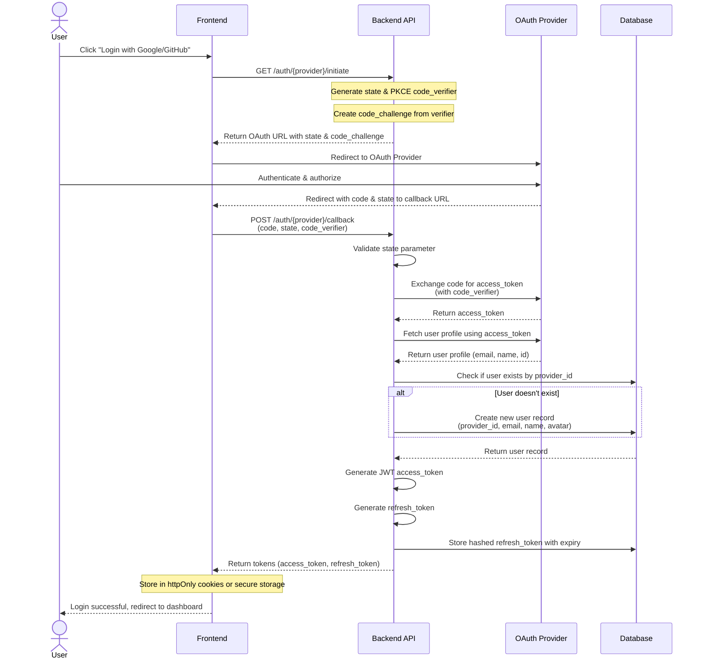
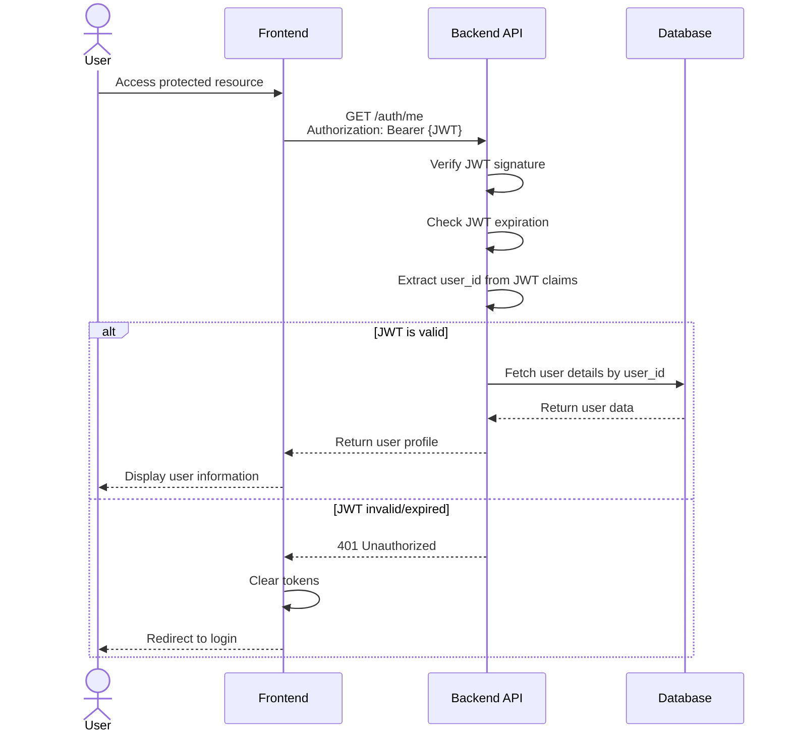
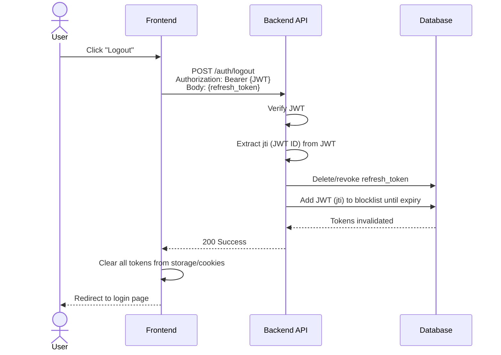
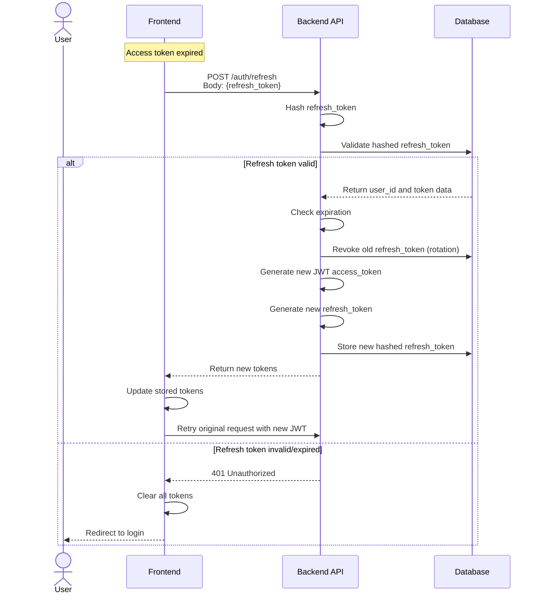

# OAuth2 Authentication Service - Secure Sequence Flow

## Overview
This document outlines a secure OAuth2 authentication flow supporting Google and GitHub providers, with JWT-based session management.

## Architecture Components

- **Frontend (Client)**: Web/mobile application
- **Backend (API Server)**: Authentication service
- **OAuth Providers**: Google & GitHub
- **Database**: User storage
- **JWT Service**: Token generation & validation

## Sequence Flows

### 1. OAuth2 Login Flow (Google/GitHub)



### 2. Get Current User Flow (Using JWT)



### 3. Logout Flow



### 4. Token Refresh Flow



## Security Measures

### 1. **OAuth2 Security**
- **PKCE (Proof Key for Code Exchange)**: Use PKCE flow to prevent authorization code interception attacks
- **State Parameter**: Generate cryptographically random state parameter to prevent CSRF attacks
- **Validate Redirect URIs**: Whitelist allowed redirect URIs on backend
- **Short-lived Authorization Codes**: OAuth codes should expire quickly (1-10 minutes)

### 2. **JWT Security**
- **Short Expiration**: Access tokens expire in 15-30 minutes
- **Secure Signing**: Use RS256 (asymmetric) or HS256 with strong secret
- **Include Claims**: `user_id`, `email`, `iat`, `exp`, `jti` (JWT ID for revocation)
- **Verify on Every Request**: Always validate signature, expiration, and issuer

### 3. **Refresh Token Security**
- **Store Hashed**: Never store refresh tokens in plain text
- **Long but Limited Expiration**: 7-30 days, force re-authentication after
- **Rotation**: Issue new refresh token on each use (recommended)
- **One-time Use**: Invalidate after being used to get new access token
- **Bind to Device/IP**: Store metadata for anomaly detection

### 4. **Transport Security**
- **HTTPS Only**: All communication over TLS 1.2+
- **Secure Cookies**: Use `HttpOnly`, `Secure`, `SameSite=Strict` flags
- **CORS Configuration**: Whitelist specific origins, not wildcard `*`

### 5. **Storage Security**
- **Frontend Storage**:
  - Access Token: Memory or httpOnly cookie (preferred)
  - Refresh Token: httpOnly cookie only (never localStorage)
- **Backend Storage**:
  - Hash refresh tokens (bcrypt/argon2)
  - Encrypt sensitive user data at rest

### 6. **Additional Protections**
- **Rate Limiting**: Limit auth endpoints (e.g., 5 requests/minute)
- **Token Revocation**: Maintain blocklist for logged-out JWTs
- **Account Linking**: Prevent takeover by verifying email ownership
- **Audit Logging**: Log all authentication events
- **Session Management**: Track active sessions per user
- **IP & Device Fingerprinting**: Detect suspicious login patterns

## API Endpoints

### Authentication Endpoints

```
POST   /auth/{provider}/initiate    # Start OAuth flow (google, github)
GET    /auth/{provider}/callback    # OAuth callback handler
POST   /auth/refresh                # Refresh access token
POST   /auth/logout                 # Logout user
GET    /auth/me                     # Get current user
```

## Database Schema

### Users Table
```sql
CREATE TABLE users (
    id UUID PRIMARY KEY,
    email VARCHAR(255) UNIQUE NOT NULL,
    name VARCHAR(255),
    avatar_url VARCHAR(500),
    created_at TIMESTAMP DEFAULT NOW(),
    updated_at TIMESTAMP DEFAULT NOW()
);
```

### OAuth Accounts Table
```sql
CREATE TABLE oauth_accounts (
    id UUID PRIMARY KEY,
    user_id UUID REFERENCES users(id) ON DELETE CASCADE,
    provider VARCHAR(50) NOT NULL, -- 'google', 'github'
    provider_user_id VARCHAR(255) NOT NULL,
    access_token_encrypted TEXT,
    refresh_token_encrypted TEXT,
    expires_at TIMESTAMP,
    created_at TIMESTAMP DEFAULT NOW(),
    UNIQUE(provider, provider_user_id)
);
```

### Refresh Tokens Table
```sql
CREATE TABLE refresh_tokens (
    id UUID PRIMARY KEY,
    user_id UUID REFERENCES users(id) ON DELETE CASCADE,
    token_hash VARCHAR(255) UNIQUE NOT NULL,
    expires_at TIMESTAMP NOT NULL,
    created_at TIMESTAMP DEFAULT NOW(),
    revoked_at TIMESTAMP,
    device_info JSONB,
    INDEX(user_id, revoked_at, expires_at)
);
```

### JWT Blocklist Table (Optional)
```sql
CREATE TABLE jwt_blocklist (
    jti VARCHAR(255) PRIMARY KEY,
    expires_at TIMESTAMP NOT NULL,
    created_at TIMESTAMP DEFAULT NOW(),
    INDEX(expires_at) -- For cleanup
);
```

## Token Response Format

```json
{
  "access_token": "eyJhbGciOiJIUzI1NiIsInR5cCI6IkpXVCJ9...",
  "refresh_token": "random_secure_token_here",
  "token_type": "Bearer",
  "expires_in": 900,
  "user": {
    "id": "uuid",
    "email": "user@example.com",
    "name": "John Doe",
    "avatar_url": "https://..."
  }
}
```

## Key Security Considerations

1. **Never expose refresh tokens** to JavaScript - use httpOnly cookies
2. **Implement token rotation** to limit damage from token theft
3. **Use PKCE** even for confidential clients for defense in depth
4. **Validate all OAuth redirects** against whitelist
5. **Monitor for suspicious patterns** (multiple devices, locations)
6. **Implement proper CORS** to prevent unauthorized domains
7. **Keep JWTs small** - don't store excessive data in claims
8. **Have a token revocation strategy** for compromised accounts
9. **Use secure random generators** for all tokens and state parameters
10. **Regularly rotate signing keys** for JWTs