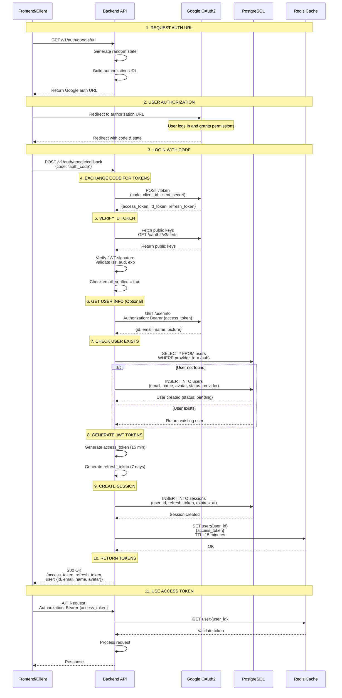

# Google OAuth2 Login Flow

## Tổng quan

Tài liệu này mô tả chi tiết flow đăng nhập sử dụng Google OAuth2 trong hệ thống, bao gồm các bước xác thực, verify ID token, và quản lý session.

## Mục lục

1. [Flow Overview](#flow-overview)
2. [Sequence Diagram](#sequence-diagram)
3. [Chi tiết từng bước](#chi-tiết-từng-bước)
4. [API Endpoints](#api-endpoints)
5. [Security Considerations](#security-considerations)
6. [Error Handling](#error-handling)

---

## Flow Overview

**Google OAuth2 Authorization Code Flow** gồm các bước chính:

1. **Client request auth URL** - Frontend gọi API để lấy Google authorization URL
2. **User authorize** - User được redirect đến Google để đăng nhập và cấp quyền
3. **Google redirect with code** - Google redirect về với authorization code
4. **Exchange code for tokens** - Backend đổi code lấy access_token và id_token
5. **Verify ID Token** - Backend verify id_token với Google's public keys
6. **Create/Update User** - Tạo hoặc cập nhật user trong database
7. **Generate JWT** - Tạo access_token và refresh_token cho hệ thống
8. **Create Session** - Lưu session vào DB và Redis
9. **Return tokens** - Trả về JWT tokens cho client

---

## Sequence Diagram



---

## Chi tiết từng bước

### 1. Request Authorization URL

**Endpoint:** `GET /v1/auth/google/url`

**Request:**
```http
GET /v1/auth/google/url HTTP/1.1
Host: api.example.com
```

**Response:**
```json
{
  "url": "https://accounts.google.com/o/oauth2/v2/auth?client_id=...&redirect_uri=...&response_type=code&scope=openid%20email%20profile&state=random_state&access_type=offline"
}
```

**Query Parameters:**
- `client_id`: Your Google OAuth2 Client ID
- `redirect_uri`: Callback URL registered in Google Console
- `response_type=code`: Request authorization code
- `scope`: openid, email, profile (user info permissions)
- `state`: Random string for CSRF protection
- `access_type=offline`: Request refresh token

---

### 2. User Authorization

User được redirect đến Google:
- Đăng nhập với Google account (nếu chưa đăng nhập)
- Xem và đồng ý cấp quyền cho app
- Google redirect về `redirect_uri` với `code` và `state`

**Callback URL:**
```
https://your-app.com/auth/callback?code=4/0Adeu5BW...&state=random_state
```

---

### 3. Exchange Code for Tokens

**Google Token Endpoint:**
```http
POST https://oauth2.googleapis.com/token
Content-Type: application/x-www-form-urlencoded

code=4/0Adeu5BW...
client_id=YOUR_CLIENT_ID
client_secret=YOUR_CLIENT_SECRET
redirect_uri=https://your-app.com/auth/callback
grant_type=authorization_code
```

**Google Response:**
```json
{
  "access_token": "ya29.a0AfH6SMBx...",
  "expires_in": 3599,
  "token_type": "Bearer",
  "scope": "openid https://www.googleapis.com/auth/userinfo.email https://www.googleapis.com/auth/userinfo.profile",
  "id_token": "eyJhbGciOiJSUzI1NiIsImtpZCI6IjU...",
  "refresh_token": "1//0gHc6..."
}
```

---

### 4. Verify ID Token

**ID Token Structure (JWT):**
```
eyJhbGciOiJSUzI1NiIsImtpZCI6IjU...  ← Header
.
eyJpc3MiOiJodHRwczovL2FjY291bnRz...  ← Payload
.
SflKxwRJSMeKKF2QT4fwpMeJf36POk...   ← Signature
```

**Payload Claims:**
```json
{
  "iss": "https://accounts.google.com",
  "sub": "110169484474386276334",
  "azp": "YOUR_CLIENT_ID",
  "aud": "YOUR_CLIENT_ID",
  "iat": 1729234567,
  "exp": 1729238167,
  "email": "user@example.com",
  "email_verified": true,
  "name": "John Doe",
  "picture": "https://lh3.googleusercontent.com/a/...",
  "given_name": "John",
  "family_name": "Doe"
}
```

**Verification Process:**
1. Download Google's public keys từ `https://www.googleapis.com/oauth2/v3/certs`
2. Decode JWT header để lấy `kid` (key ID)
3. Verify signature với public key tương ứng
4. Validate claims:
   - `iss`: Must be `accounts.google.com`
   - `aud`: Must match your CLIENT_ID
   - `exp`: Must not be expired
   - `iat`: Must be valid issued time
5. Check `email_verified = true`

---

### 5. Get User Info (Optional)

Nếu cần thông tin bổ sung, gọi UserInfo endpoint:

**Request:**
```http
GET https://www.googleapis.com/oauth2/v2/userinfo
Authorization: Bearer {access_token}
```

**Response:**
```json
{
  "id": "110169484474386276334",
  "email": "user@example.com",
  "verified_email": true,
  "name": "John Doe",
  "given_name": "John",
  "family_name": "Doe",
  "picture": "https://lh3.googleusercontent.com/a/..."
}
```

---

### 6. Create or Update User

**Logic:**
1. Check if user exists by `provider_id` (Google's `sub` claim)
2. If not found → Create new user with:
   - Email from verified ID token
   - Name, avatar from userinfo
   - Status: `pending` or `active`
   - Provider: `google`
   - Provider ID: Google's `sub`
3. If found → Continue with existing user

**User Status:**
- `pending`: Mới tạo, chờ xác thực bổ sung
- `active`: Đã xác thực, có thể sử dụng hệ thống
- `blocked`: Tạm khóa
- `banned`: Cấm vĩnh viễn

---

### 7. Generate JWT Tokens

**Token Configuration:**
- **Access Token**: Short-lived (15 minutes)
- **Refresh Token**: Long-lived (7 days)

**JWT Payload:**
```json
{
  "user_id": "uuid",
  "email": "user@example.com",
  "name": "John Doe",
  "exp": 1729235467,
  "iat": 1729234567
}
```

---

### 8. Create Session

**Save to PostgreSQL:**
```sql
INSERT INTO sessions (
    id,
    user_id,
    refresh_token,
    user_agent,
    ip_address,
    is_blocked,
    refresh_token_expires_at,
    created_at,
    updated_at
) VALUES (
    'uuid',
    'user_uuid',
    'refresh_token_hash',
    'Mozilla/5.0...',
    '192.168.1.1',
    false,
    NOW() + INTERVAL '7 days',
    NOW(),
    NOW()
);
```

**Save to Redis:**
```
Key: user:{user_id}
Value: access_token_jwt
TTL: 15 minutes
```

**Redis Key Structure:**
```
user:uuid-123 → "access_token_jwt"  (TTL: 15 minutes)
```

---

### 9. Return Response

**Success Response:**
```json
{
  "access_token": "eyJhbGciOiJIUzI1NiIsInR5cCI6IkpXVCJ9...",
  "refresh_token": "eyJhbGciOiJIUzI1NiIsInR5cCI6IkpXVCJ9...",
  "access_token_expires_at": "15m",
  "refresh_token_expires_at": "168h",
  "user": {
    "id": "uuid",
    "email": "user@example.com",
    "name": "John Doe",
    "avatar": "https://lh3.googleusercontent.com/a/...",
    "status": "active",
    "provider": "google",
    "provider_id": "110169484474386276334",
    "created_at": "2025-10-18T10:00:00Z",
    "updated_at": "2025-10-18T10:00:00Z"
  }
}
```

---

## API Endpoints

### 1. Get Authorization URL

```http
GET /v1/auth/google/url
```

**Response:**
```json
{
  "url": "https://accounts.google.com/o/oauth2/v2/auth?..."
}
```

---

### 2. Login with Authorization Code

```http
POST /v1/auth/google/callback
Content-Type: application/json

{
  "code": "4/0Adeu5BW..."
}
```

**Response:**
```json
{
  "access_token": "...",
  "refresh_token": "...",
  "access_token_expires_at": "15m",
  "refresh_token_expires_at": "168h",
  "user": { ... }
}
```

---

### 3. Get User Profile

```http
GET /v1/auth/profile
Authorization: Bearer {access_token}
```

**Response:**
```json
{
  "id": "uuid",
  "email": "user@example.com",
  "name": "John Doe",
  "avatar": "...",
  "status": "active"
}
```

---

### 4. Logout

```http
POST /v1/auth/logout
Authorization: Bearer {access_token}
```

**Response:**
```json
{
  "message": "Logged out successfully"
}
```

---

## Security Considerations

### 1. State Parameter (CSRF Protection)
- Generate random state cho mỗi authorization request
- Verify state khi nhận callback
- Prevents CSRF attacks

### 2. ID Token Verification
- **Always verify ID token** với Google's public keys
- Check `iss`, `aud`, `exp`, `email_verified`
- Don't trust ID token without verification

### 3. HTTPS Only
- All OAuth2 flows MUST use HTTPS
- Prevent token interception

### 4. Token Storage
- **Access token**: Store in Redis với TTL ngắn (15 min)
- **Refresh token**: Store hashed in PostgreSQL
- **Never** store plaintext tokens in frontend localStorage (vulnerable to XSS)
- Use httpOnly cookies hoặc secure storage

### 5. Session Management
- Track active sessions per user
- Allow user to revoke sessions
- Block suspicious sessions

### 6. Rate Limiting
- Limit login attempts per IP
- Prevent brute force attacks

### 7. Scope Minimization
- Only request necessary scopes: `openid email profile`
- Don't request excessive permissions

---

## Error Handling

### Common Errors

#### 1. Invalid Authorization Code
```json
{
  "error": "invalid_grant",
  "error_description": "Code was already redeemed"
}
```
**Cause:** Code đã được sử dụng hoặc expired (10 minutes)

---

#### 2. Invalid ID Token
```json
{
  "error": "invalid_id_token",
  "message": "Token signature verification failed"
}
```
**Cause:** Token bị giả mạo hoặc không match với client_id

---

#### 3. Email Not Verified
```json
{
  "error": "email_not_verified",
  "message": "User email is not verified by Google"
}
```
**Cause:** User chưa verify email với Google

---

#### 4. User Blocked
```json
{
  "error": "user_blocked",
  "message": "Your account has been blocked"
}
```
**Cause:** User status = "blocked" or "banned"

---

## Environment Variables

```env
# Google OAuth2
CLIENT_ID_GOOGLE=your_client_id.apps.googleusercontent.com
CLIENT_SECRET_GOOGLE=your_client_secret
REDIRECT_URL_GOOGLE=http://localhost:8080/auth/callback
SCOPES_GOOGLE=openid,email,profile

# JWT
SECRET_KEY=your_jwt_secret_key
ACCESS_TOKEN_TIME_LIFE=15    # minutes
REFRESH_TOKEN_TIME_LIFE=168  # hours (7 days)

# Database
DB_HOST=localhost
DB_PORT=5432
DB_USER=postgres
DB_PASSWORD=password
DB_NAME=oauth2_db

# Redis
REDIS_HOST=localhost
REDIS_PORT=6379
REDIS_PASSWORD=
```

---

## Google Cloud Console Setup

### 1. Create OAuth2 Credentials
1. Go to [Google Cloud Console](https://console.cloud.google.com/)
2. Create new project or select existing
3. Enable **Google+ API**
4. Navigate to **Credentials** → **Create Credentials** → **OAuth client ID**
5. Select **Web application**
6. Add **Authorized redirect URIs**:
   - `http://localhost:8080/auth/callback` (development)
   - `https://your-domain.com/auth/callback` (production)

### 2. Configure Consent Screen
1. **OAuth consent screen** → External
2. Add app name, logo, support email
3. Add scopes: `openid`, `email`, `profile`
4. Add test users (for development)

---

## Testing

### Manual Test Flow

1. **Get auth URL:**
```bash
curl http://localhost:8080/v1/auth/google/url
```

2. **Open URL in browser** → Login with Google

3. **Copy code from callback URL**

4. **Login with code:**
```bash
curl -X POST http://localhost:8080/v1/auth/google/callback \
  -H "Content-Type: application/json" \
  -d '{"code": "4/0Adeu5BW..."}'
```

5. **Use access token:**
```bash
curl http://localhost:8080/v1/auth/profile \
  -H "Authorization: Bearer {access_token}"
```

---

## Best Practices

1. ✅ Always verify ID token với Google
2. ✅ Use HTTPS in production
3. ✅ Implement CSRF protection với state parameter
4. ✅ Store refresh tokens hashed
5. ✅ Use short-lived access tokens (15 min)
6. ✅ Implement token refresh flow
7. ✅ Log all authentication events
8. ✅ Monitor suspicious activities
9. ✅ Allow users to manage sessions
10. ✅ Implement rate limiting

---

## References

- [Google OAuth2 Documentation](https://developers.google.com/identity/protocols/oauth2)
- [OpenID Connect Specification](https://openid.net/specs/openid-connect-core-1_0.html)
- [OAuth 2.0 RFC 6749](https://datatracker.ietf.org/doc/html/rfc6749)
- [ID Token Verification](https://developers.google.com/identity/gsi/web/guides/verify-google-id-token)

---

**Last Updated:** October 18, 2025  
**Version:** 1.0
