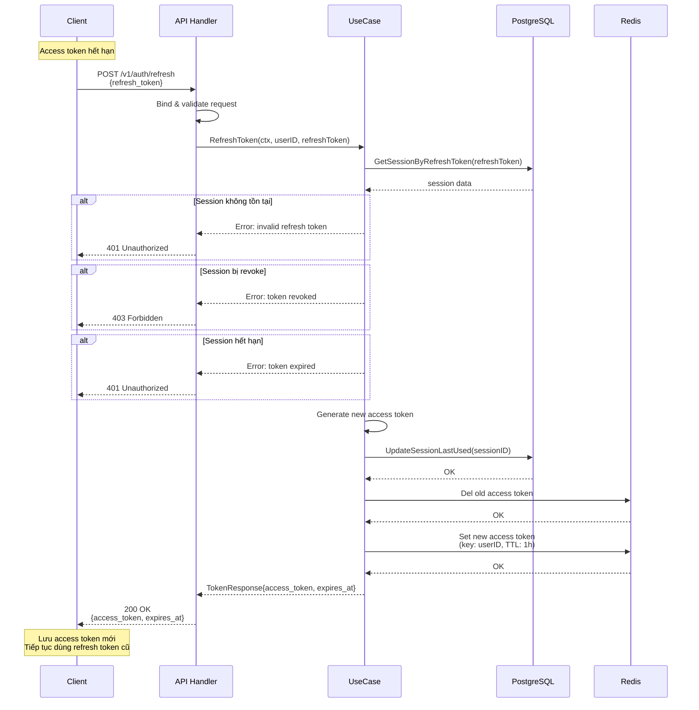

# Flow Renew JWT Token (Refresh Token)

## Tổng quan

Khi access token hết hạn, client sử dụng refresh token để lấy access token mới mà không cần đăng nhập lại. Flow này đảm bảo bảo mật, chống replay attack và hỗ trợ token rotation.

---

## Sequence Diagram



---

## Flow chi tiết

### 1. Client gửi refresh token

Client gọi API:
```
POST /v1/auth/refresh
Content-Type: application/json

{
  "refresh_token": "eyJhbGc..."
}
```

### 2. Server validate refresh token

- Kiểm tra refresh token có tồn tại trong DB không
- Kiểm tra token chưa hết hạn (`expires_at > now()`)
- Kiểm tra token chưa bị revoke (`is_blocked = false`)
- Kiểm tra token thuộc về user hợp lệ

### 3. Server tạo access token mới

```go
// Lấy access token lifetime từ config (time.Duration)
accessTokenLifetime := time.Duration(config.AccessTokenTimeLife) * time.Hour

// Tạo access token mới
newAccessToken, accessClaims := GenerateToken(
    userID, 
    email, 
    name, 
    accessTokenLifetime,  // time.Duration
    secretKey
)

// Giữ nguyên refresh token cũ (không rotation)
// Chỉ cập nhật last_used timestamp trong DB
```

### 4. Server cập nhật DB & Redis

**DB Update:**
```sql
-- Cập nhật last_used timestamp (optional, để tracking)
UPDATE sessions 
SET updated_at = now(),
    last_used_at = now()
WHERE refresh_token = 'refresh_token' 
  AND user_id = 'user_id'
  AND is_blocked = false;
```

**Redis:**
```go
// Xóa access token cũ
redis.Del(ctx, fmt.Sprintf("access:%s", userID))

// Lưu access token mới với TTL
redis.Set(
    ctx, 
    fmt.Sprintf("access:%s", userID),
    newAccessToken,
    time.Until(accessClaims.ExpiresAt.Time)
)
```

### 5. Server trả về access token mới

Response:
```json
{
  "status": 200,
  "access_token": "eyJhbGc...",
  "access_token_expires_at": "2025-10-17T08:00:00Z"
}
```

**Lưu ý:** Refresh token không thay đổi, client tiếp tục dùng refresh token cũ cho các lần refresh tiếp theo.

---

## Xử lý lỗi

| Trường hợp | HTTP Status | Message |
|-----------|-------------|---------|
| Refresh token không hợp lệ | 401 | Invalid refresh token |
| Refresh token hết hạn | 401 | Refresh token expired |
| Refresh token đã bị revoke | 403 | Refresh token revoked |
| Refresh token bị replay | 403 | Token reuse detected |
| User không tồn tại | 404 | User not found |

---

## Bảo mật

### ⚠️ Lưu ý khi KHÔNG dùng Token Rotation
- Refresh token không thay đổi → nếu bị đánh cắp, attacker có thể dùng mãi cho đến khi hết hạn
- **Khuyến nghị:**
  - Đặt thời gian sống ngắn hơn cho refresh token (7-14 ngày thay vì 30 ngày)
  - Bắt buộc re-login định kỳ
  - Track last_used timestamp và user_agent/IP để phát hiện bất thường
  - Revoke toàn bộ session khi logout hoặc đổi password
  - Implement "maximum refresh count" để giới hạn số lần dùng 1 refresh token

### Rate Limiting
- Giới hạn số lần gọi `/refresh` mỗi phút (ví dụ: 5 lần/phút/user)
- Chặn IP có hành vi bất thường

### Storage
- Refresh token lưu trong DB với thời gian hết hạn dài (30 ngày)
- Access token lưu trong Redis với TTL ngắn (1 giờ)
- Optional: hash refresh token trước khi lưu DB

---

## Code implementation

### API Handler (delivery/impl/auth.go)

```go
// @Summary Refresh access token
// @Description Renew access token using refresh token
// @Tags Auth
// @Accept json
// @Produce json
// @Param body body RefreshTokenRequest true "Refresh token"
// @Success 200 {object} TokenResponse
// @Failure 401 {object} ErrorResponse
// @Router /v1/auth/refresh [post]
func (d *implAuth) handlerRefreshToken(c echo.Context) error {
    var req RefreshTokenRequest
    if err := c.Bind(&req); err != nil {
        return c.JSON(400, map[string]string{
            "error": "Invalid request"
        })
    }

    // Verify refresh token
    claims, err := utils.VerifyToken(req.RefreshToken, d.config.SecretKey)
    if err != nil {
        return c.JSON(401, map[string]string{
            "error": "Invalid or expired refresh token"
        })
    }

    // Call usecase to refresh
    tokens, err := d.useCase.Auth().RefreshToken(
        c.Request().Context(), 
        claims.Id, 
        req.RefreshToken
    )
    if err != nil {
        return c.JSON(401, map[string]string{
            "error": err.Error()
        })
    }

    return c.JSON(200, tokens)
}
```

### Usecase Logic

```go
func (u *AuthUseCase) RefreshToken(
    ctx context.Context, 
    userID uuid.UUID, 
    refreshToken string
) (*TokenResponse, error) {
    // 1. Kiểm tra session tồn tại và hợp lệ
    session, err := u.repo.Auth().GetSessionByRefreshToken(ctx, refreshToken)
    if err != nil {
        return nil, errors.New("invalid refresh token")
    }

    if session.IsBlocked {
        return nil, errors.New("refresh token revoked")
    }

    if time.Now().After(session.RefreshTokenExpiresAt) {
        return nil, errors.New("refresh token expired")
    }

    // 2. Tạo access token mới
    accessTokenLifetime := time.Duration(u.config.AccessTokenTimeLife) * time.Hour
    newAccessToken, accessClaims := utils.GenerateToken(
        userID,
        session.UserEmail,
        session.UserName,
        accessTokenLifetime,
        u.config.SecretKey,
    )

    // 3. Cập nhật last_used timestamp trong DB (optional)
    err = u.repo.Auth().UpdateSessionLastUsed(ctx, session.ID)
    if err != nil {
        // Log error nhưng không fail request
    }

    // 4. Update Redis với access token mới
    u.repo.Redis().CreateRecord(
        userID, 
        newAccessToken, 
        time.Until(accessClaims.ExpiresAt.Time)
    )

    return &TokenResponse{
        AccessToken:          newAccessToken,
        AccessTokenExpiresAt: accessClaims.ExpiresAt.Time,
    }, nil
}
```

---

## Testing

### Test cases cần cover:

1. ✅ Happy path: refresh token hợp lệ → trả về access token mới
2. ✅ Refresh token hết hạn → 401
3. ✅ Refresh token đã revoke → 403
4. ✅ Refresh token không tồn tại → 401
5. ✅ Rate limiting
6. ✅ Concurrent refresh requests với cùng refresh token
7. ✅ Redis failure handling

---

## Checklist triển khai

- [ ] Thêm endpoint `POST /v1/auth/refresh` trong router
- [ ] Implement usecase method `RefreshToken`
- [ ] Thêm repo methods: `GetSessionByRefreshToken`, `UpdateSessionLastUsed`
- [ ] Update Redis logic để lưu access token mới
- [ ] (Optional) Thêm column `last_used_at` vào bảng `sessions`
- [ ] Thêm rate limiting middleware
- [ ] Viết unit tests
- [ ] Update Swagger docs
- [ ] Test end-to-end flow

---

## Lưu ý quan trọng

1. **Luôn dùng HTTPS** trong production
2. **KHÔNG rotation** → refresh token dễ bị lợi dụng nếu bị đánh cắp
3. **Giảm TTL** của refresh token (7-14 ngày thay vì 30 ngày)
4. **Logging** mọi refresh attempt để audit và phát hiện bất thường
5. **Revoke** toàn bộ session khi logout hoặc đổi password
6. **Token lifetime**: dùng `time.Duration` từ config
   - Access token: `time.Duration(config.AccessTokenTimeLife) * time.Hour` (ví dụ: 1-2 giờ)
   - Refresh token: `time.Duration(config.RefreshTokenTimeLife) * time.Hour` (ví dụ: 7-14 ngày)
7. **Track usage**: last_used_at, user_agent, IP để phát hiện suspicious activity
