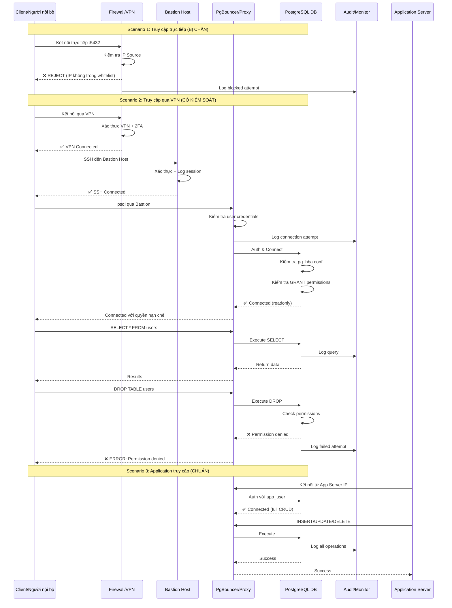

# Database Security Architecture
 ========================================
 GIỚI THIỆU
 ========================================
 Vấn đề: Người nội bộ hoặc client có thể dùng GUI tools 
 (pgAdmin, DBeaver, TablePlus...) để kết nối trực tiếp 
 vào PostgreSQL và thao tác dữ liệu không kiểm soát.

 Giải pháp: Áp dụng kiến trúc bảo mật nhiều lớp (Defense in Depth)

 ========================================
 CÁC THÀNH PHẦN TRONG HỆ THỐNG
 ========================================
 1. Client/Người nội bộ: 
    - Nhân viên có nhu cầu truy cập DB
    - Có thể cài GUI tools
    - Không được tin tưởng hoàn toàn

 2. Firewall/VPN:
    - Lớp bảo vệ đầu tiên
    - Chặn kết nối từ IP không được phép
    - Yêu cầu xác thực VPN (2FA)

 3. Bastion Host (Jump Server):
    - Server trung gian bắt buộc
    - Log tất cả SSH sessions
    - Kiểm soát ai truy cập, khi nào, làm gì

 4. PgBouncer/Proxy:
    - Connection pooler
    - Ẩn thông tin DB thật
    - Thêm lớp kiểm soát và logging

 5. PostgreSQL Database:
    - Cấu hình pg_hba.conf chặt chẽ
    - Phân quyền theo nguyên tắc least privilege
    - Bật audit logging

 6. Audit/Monitor:
    - Ghi log mọi hành động
    - Alert khi có hành vi bất thường
    - Compliance và forensics

 7. Application Server:
    - Server chạy ứng dụng chính
    - Duy nhất có quyền CRUD đầy đủ
    - IP được whitelist

 ========================================
 3 KỊCH BẢN TRONG SƠ ĐỒ
 ========================================
 Scenario 1: Truy cập trực tiếp (BỊ CHẶN) ❌
   → Client cố kết nối thẳng vào PostgreSQL port 5432
   → Firewall reject ngay lập tức
   → Ghi log để điều tra

 Scenario 2: Truy cập qua VPN (CÓ KIỂM SOÁT) 🟡
   → Phải qua VPN → Bastion → PgBouncer → PostgreSQL
   → Mỗi lớp có xác thực riêng
   → Chỉ được quyền SELECT (readonly)
   → Không thể DROP/TRUNCATE

 Scenario 3: Application access (CHUẨN) ✅
   → App server có IP whitelist
   → Quyền INSERT/UPDATE/DELETE đầy đủ
   → Đây là luồng bình thường của hệ thống

 ========================================
